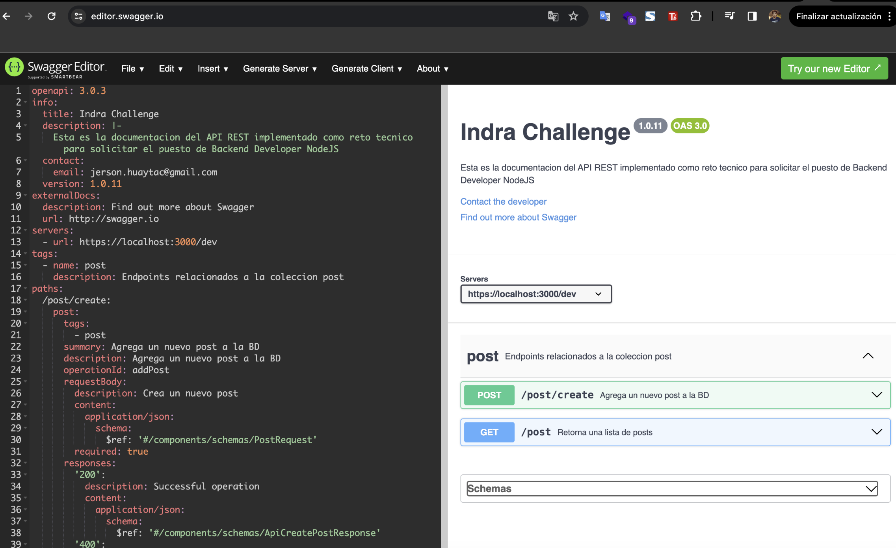

# Indra Challenge

Los proyectos dentro del repositorio tienen como principal stack `aws-nodejs-typescript` , se interpreta como dos lambdas independientes 

# Documentacion

En la raíz del proyecto se podrá encontrar el archivo documentation.swagger.yml, el cual esta la documentación de los endpoint, por lo que para visualizarse se puede copiar el contenido de dicho archivo y ejecutarlo en el siguiente [enlace](https://editor.swagger.io/) para visualizar el contenido de la documentacion de uso como se muestra en la siguiente imagen



Adicionalmente se adjunta lor CURL para ser importados en postman 
Crear Post :

```
curl --location 'http://localhost:3000/dev/post/create   ' \
--header 'Content-Type: application/json' \
--data '{
  "author": "Silvia Cammi",
  "review": "Ejemplo de calificacion",
  "title": "Ejemplo de titulo",
  "observation": "ejemplo de observacion"
}'
```


Listar Post:
```
curl --location 'http://localhost:3000/dev/post/'
```

# Despliegues
Para poder desplegar los lambdas se debe configurar las credenciales de la cuenta de AWS se debe ejecutar el comando `sls config credentials` en el equipo desde donde se desea desplegar para configurar las credenciales de la cuenta de AWS donde se va desplegar

Una vez configurado las credenciales, se debe acceder al lambda que se desea desplegar y se podra realizar el deploy con el comando `sls deploy`